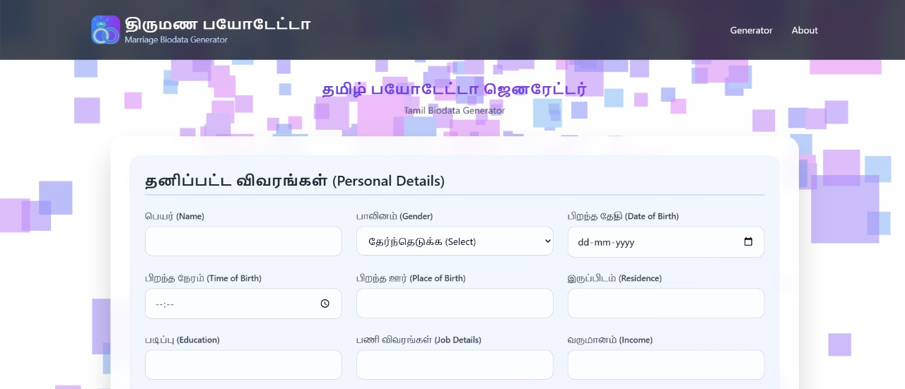

<!-- Option A: a bare anchor with an ID -->

<a id="readme-top"></a>

<p align="center">
    <a href="https://rpdil23.github.io/marriage-biodata-generator/"></a>
</p>

# Welcome to your Marriage Biodata Generator

Create beautiful marriage biodata with traditional astrological charts. Generate professional biodata in Tamil and English with instant PDF download.

**Use your preferred IDE**

If you want to work locally using your own IDE, you can clone this repo and push changes. Pushed changes will also be reflected in Lovable.

The only requirement is having Node.js & npm installed - [install with nvm](https://github.com/nvm-sh/nvm#installing-and-updating)

We a using bun in this project so Follow these steps:

```sh
#step 1: Install Bun
powershell -c "irm bun.sh/install.ps1 | iex"
```

```sh
# Step 1: Clone the repository using the project's Git URL.
git clone https://github.com/rpdil23/marriage-biodata-generator.git

# Step 2: Navigate to the project directory.
cd marriage-biodata-generator

# Step 3: Install the necessary dependencies.
bun i

# Step 4: Start the development server with auto-reloading and an instant preview.
bun run dev
```

## What technologies are used for this project?

This project is built with:

- Vite
- TypeScript
- React
- shadcn-ui
- Tailwind CSS
- PWA

## 👋 Contributing

- create issue
- create PR with branch name format of `<issue number>-<short name>`

## 🌟 Contributors

[](https://github.com/rpdil23/marriage-biodata-generator/graphs/contributors)

[](https://star-history.com/#rpdil23/marriage-biodata-generator&Date)

<div align="right">
  [![][back-to-top]](#readme-top)
</div>

---

Copyright © 2025 [Marriage-Biodata-Generator][profile-link]. <br />
This project is [Dual Licence](./LICENCE) licensed.

<!-- LINK GROUP -->

[back-to-top]: https://img.shields.io/badge/-BACK_TO_TOP-222628?style=flat-square
[profile-link]: https://github.com/rpdil23
